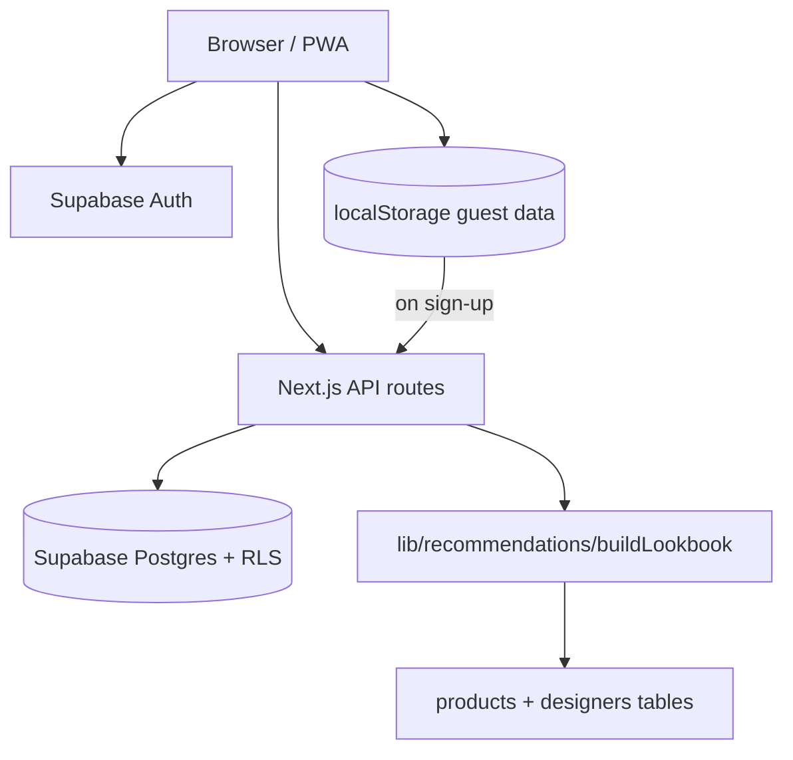

# Archive411 Architecture

## Route map

| Route | Status | Notes |
|-------|--------|-------|
| `/` | Complete | Redirects intro → auth → home |
| `/intro` | Complete | Two-slide onboarding |
| `/auth` | Partial → Beta | Email + guest; Google deferred |
| `/home` | Complete | Discovery hub |
| `/build` | Partial → Beta | Questionnaire; wired to `/api/recommendations/build` |
| `/search` | Partial | Client-side catalog search |
| `/surprise` | Partial | Random lookbook from seed catalog |
| `/independent` | Partial | Independent designer discovery |
| `/discover` | Partial | Style communities (opt-in) |
| `/generate` | Partial | Quick quiz → `/results` |
| `/results` | Mock | High-Low editorial matrix (12 profiles) |
| `/lookbooks/[id]` | Partial → Beta | Detail + save; API-backed when saved |
| `/archive` | Partial → Beta | My Archive; Supabase persistence |
| `/saved` | Complete | Redirect to `/archive` |
| `/profile` | Partial | User profile + sign out |
| `/designers`, `/designers/[slug]` | Partial | Browse seed/DB catalog |
| `/destinations`, `/destinations/[slug]` | Partial | City guides |
| `/showrooms`, `/showrooms/[slug]` | Partial | Showroom + fitting flow |
| `/fitting-list` | Partial | localStorage fitting lists |
| `/for-designers`, `/for-designers/apply` | Partial | Application form |
| `/designer/dashboard` | Dead | All sections "Coming soon" |
| `/api/generate` | Mock | Legacy mock looks endpoint |
| `/api/affiliate` | Complete | Rakuten/Impact redirect builder |
| `/api/recommendations/build` | Beta | Structured lookbook generation |
| `/api/lookbooks` | Beta | List/save user lookbooks |
| `/api/lookbooks/[id]` | Beta | Fetch lookbook with looks + products |
| `/api/products/search` | Beta | Filtered catalog query |

## Data flow (beta target)

## What is real vs mocked

| Feature | Beta status |
|---------|-------------|
| Email authentication | Real (Supabase) |
| Google OAuth | Deferred — UI shows "Coming soon" |
| Guest mode | Local device; migrates on sign-up |
| My Archive | Real (Supabase) for authenticated users |
| Catalog | Limited verified seed (~15–25 products); reference examples excluded |
| Recommendations | Structured server-side scoring; no AI hallucination |
| Affiliate links | Real URL builder when env vars set |
| Designer dashboard | Mock shell |
| Collections UI | Not implemented (API/model only) |
| Fitting list submit | localStorage only |

## Storage keys (guest migration)

- `archive411-session` — legacy; replaced by Supabase session
- `archive411-guest-id` — guest identifier for migration
- `archive411-archive-{guestId}` — guest lookbooks pending migration
- `archive411-saved-lookbook-sessions` — full lookbook payloads
